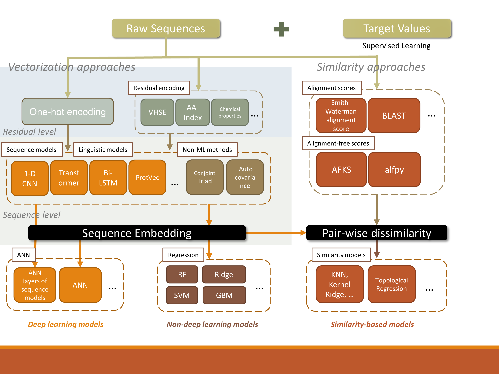
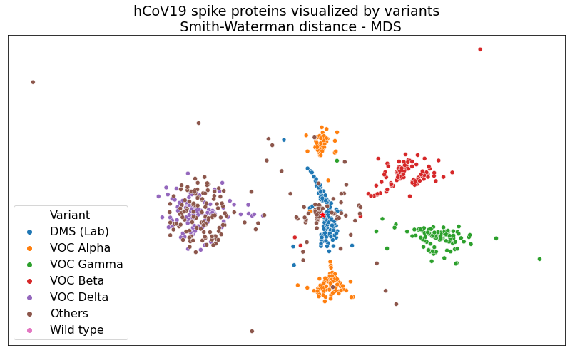

# cov_seqs

Code for reproducing the results in *Zhang, et. al. Predicting binding affinities of emerging variants of SARS-CoV-2 using spike protein sequencing data: Observations, caveats and recommendations (Briefings in bioinformatics 2022, in press)* 

## Overview

This repository provides the code to reproduce the results of the following models: Smith-Waterman alignment score -> topological regression; VHSE -> 1D CNN; Bi-LSTM - FC layers or ridge regression; ProtBERT embedding -> FC layers or ridge regression.

Special dependencies:

Model performances are evaluated with module myToolbox. https://github.com/Ribosome25/myToolbox 

Argument parser TAP: `pip install typed-argument-parser`

## Data Preprocessing and Embedding Generation

### Distance calculation 

Smith-Waterman distances (negative alignment scores) and Levenshtein distances are computed and used in subsequent modeling. For subsampled datasets, distances are computed at runtime. For the whole set, distances are precomputed using MPI parallel computing for time concerns. 

Check out `scripts/SW_distance.sh` and `mpi_SW_distance.py` for using MPI distance precomputation.

### LSTM / BERT embedding generation

LSTM is modified from https://github.com/brianhie/viral-mutation. bin/combinatorial_fitness.py, bin/mutation.py and bin/cov.py are modified for our usage. The modified files are provided in `ref_models/science2021`. 

An example of using the embedding generation: after cloning Brian Hie's repo, replace bin/combinatorial_fitness.py, bin/mutation.py and bin/cov.py with the code provided here and run

`python ./viral-mutation/bin/cov.py bilstm --checkpoint ../models/cov.hdf5 --self-embed-fitness`

to generate BiLSTM embeddings. Modify the model types and checkpoint path as needed.

BERT embedding is generated with `ref_models/ProtBert/ProtBert.py`.

### VHSE

VHSE encoding is generated with MPI parallelly. 

Run `ref_models/mpi_vhse.py` with input and output path as arguments. See `ref_models/args.py` for arguments details. 

## Experiments and Results

The script for most of the modeling and performance evaluation is provided in `scripts/model_CoV_seq.py`.

A set of functions is provided for testing each model. Examples of how to use these functions are provided after the `if __name__ == "__main__":` statement.

### Topological regression

Refer to `model_CoV_seq.py` and `model_CoV_seq_clf`

Examples:

https://github.com/Ribosome25/cov_seqs/blob/6c79b50ad40d7957587f186dfbbe8328883af51f/model_CoV_seq.py#L151 is for 0.5% and 5% subsampled dataset. 

and https://github.com/Ribosome25/cov_seqs/blob/6c79b50ad40d7957587f186dfbbe8328883af51f/model_CoV_seq.py#L268 is for whole dataset (pre-computed distances). 

Calling these functions at https://github.com/Ribosome25/cov_seqs/blob/6c79b50ad40d7957587f186dfbbe8328883af51f/model_CoV_seq.py#L511

Topo Reg using CNN as similarity metric: `model_CoV_CNN_topo.py`

### VHSE - CNN

Model output, performance: `model_CoV_VHSE_CNN` and `model_CoV_VHSE_CNN_clf`

Grid search parameter tuning: `model_VHSE_CNN_gridsearch_clf` 

Random search parameter tuning: `keras_tuner_CNN_run.py`

### LSTM and ProtBERT

Embeddings are first generated. 

Ridge and linear regression performance are evaluated in  `model_CoV_seq.py` and `model_CoV_seq_clf`

Example: https://github.com/Ribosome25/cov_seqs/blob/6c79b50ad40d7957587f186dfbbe8328883af51f/model_CoV_seq.py#L369 

* Pass scikit-learn Estimators to `ref_mdl` to evaluate different regressors (or clfs)
* Pass 'sci' to `dataset` for LSTM embedding, and "ProtBert" for BERT embedding. 
* `pooling` indicates pooling method of the embeddings. See https://github.com/Ribosome25/cov_seqs/blob/6c79b50ad40d7957587f186dfbbe8328883af51f/model_CoV_seq.py#L537
* Comment / uncomment L378 - L382 to choose between the binding dataset or expression dataset (different target values). 

FC-layers parameter grid search and performances evaluation are in `model_NLP_fc_gridsearch.py` and `model_NLP_fc_gridsearch_clf.py`  Random search in `keras_tuner_ANN_run.py`

### KNN models

Evaluated in  `model_CoV_seq.py` and `model_CoV_seq_clf`

Checkout `knn_ref_holdout_model()` https://github.com/Ribosome25/cov_seqs/blob/6c79b50ad40d7957587f186dfbbe8328883af51f/model_CoV_seq.py#L412 for details. 

### Clustering scatter plot and visualization

See `visualization/GisAid1203.ipynb`

